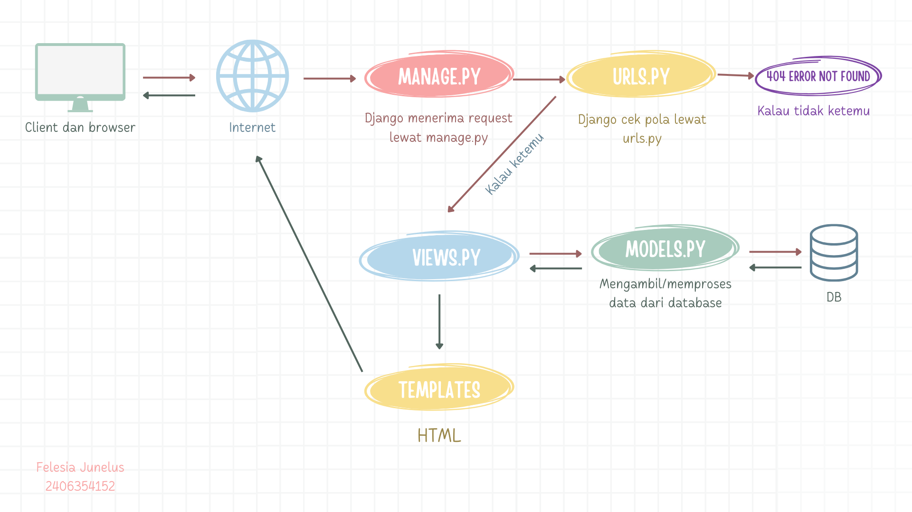
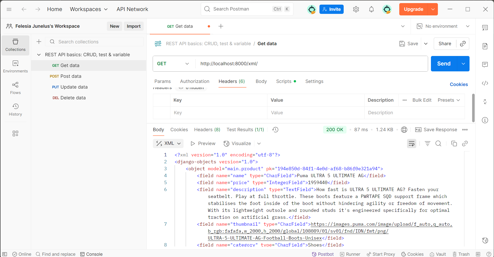
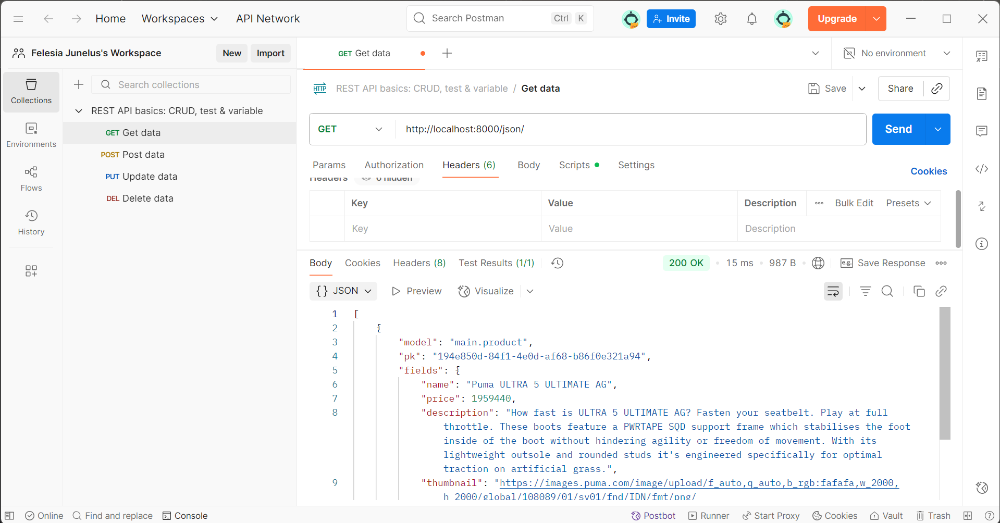
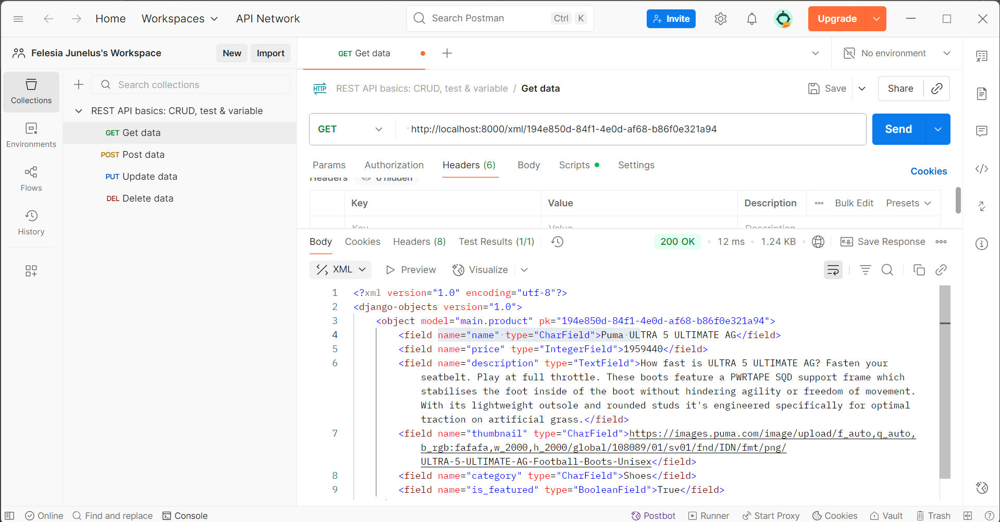
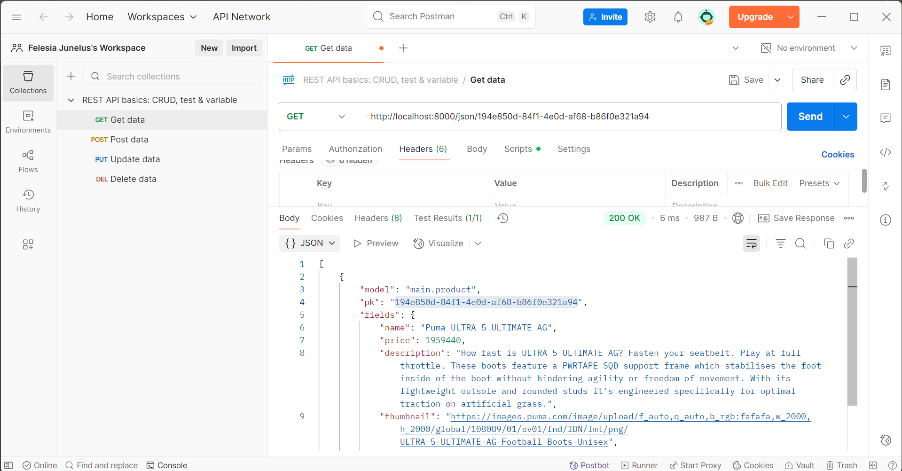

# TUGAS INDIVIDU PBP
**Felesia Junelus - 2406354152 - PBP C**  
[Link Deployment](https://felesia-junelus-footballshop.pbp.cs.ui.ac.id/)

---
## Daftar Isi
- [README.md Tugas 2](#tugas-2-pbp)
  - [Penjelasan langkah-langkah yang dilakukan](#penjelasan-langkah-langkah-yang-dilakukan)
  - [Alur request client ke web](#alur-request-client-ke-web)
  - [Peran `settings.py` dalam proyek Django](#peran-settingspy-dalam-proyek-django)
  - [Migrasi database di Django](#migrasi-database-di-django)
  - [Framework Django sebagai awal pembelajaran pengembangan perangkat lunak](#framework-django-sebagai-awal-pembelajaran-pengembangan-perangkat-lunak)
  - [Review asdos tutorial 1](#review-asdos-tutorial-1)

- [README.md Tugas 3](#tugas-3-pbp)
  - [Alasan perlunya data delivery dalam pengimplementasian sebuah platform](#alasan-perlunya-data-delivery-dalam-pengimplementasian-sebuah-platform)
  - [Mana yang lebih baik antara XML dan JSON?](#menurutmu-mana-yang-lebih-baik-antara-xml-dan-json-mengapa-json-lebih-populer-dibandingkan-xml)
  - [Fungsi method `is_valid()` pada form](#jelaskan-fungsi-dari-method-is_valid-pada-form-django-dan-mengapa-kita-membutuhkan-method-tersebut)
  - [Kegunaan `csrf_token` saat membuat form di Django](#mengapa-kita-membutuhkan-csrf_token-saat-membuat-form-di-django-apa-yang-dapat-terjadi-jika-kita-tidak-menambahkan-csrf_token-pada-form-django-bagaimana-hal-tersebut-dapat-dimanfaatkan-oleh-penyerang)
  - [Step-by-step yang dilakukan](#jelaskan-bagaimana-cara-kamu-mengimplementasikan-checklist-di-atas-secara-step-by-step-bukan-hanya-sekadar-mengikuti-tutorial)
  - [Review asdos tutorial 2](#review-asdos-tutorial-2)
  - [Dokumentasi akses postman](#dokumentasi-akses-postman)


## TUGAS 2 PBP

### Penjelasan Langkah-Langkah yang dilakukan
#### Membuat sebuah proyek django baru

**1. Mengaktifkan virtual environment**
``` 
python -m venv env
env\Scripts\activate
```

Tujuannya agar project yang dibuat memiliki lingkungan Python yang terisolasi. Sehingga nantinya library yang diinstal hanya berlaku di env itu.

**2. Menyiapkan Dependencies dan Membuat Proyek Django**
Saya membuat requirements.txt dengan isi seperti yang dijelaskan di tutorial 0. Kemudian saya lakukan instalasi terhadap dependencies dengan perintah berikut.
```
pip install -r requirements.txt
django-admin startproject football_news .
```
Kemudian setelah itu saya melakukan konfigurasi environment variables dan proyek seperti step by step yang dijelaskan di tutorial 0 (membuat file .env dan .env.prod, modifikasi settings.py untuk menambahkan environment variables, menambahkan allowed host, menambah konfigurasi production, dan mengubah konfigurasi database).

#### Membuat aplikasi dengan nama main pada proyek tersebut.
Saya menjalankan perintah berikut di cmd
```
python manage.py startapp main
```
lalu menambahkan 'main' di INSTALLED_APPS di settings.py

#### Membuat model pada aplikasi main dengan nama Product dan menambah atributnya
1. Saya menambah kelas Product di models.py dan atribut wajib sesuai yang sudah diinstruksikan di deskripsi tugas 2.
2. Saya melakukan migrasi model supaya perubahan yang saya buat di models.py tercatat dan diterapkan ke database oleh Django dengan menjalankan perintah berikut.
```
python manage.py makemigrations
python manage.py migrate
```

#### Membuat sebuah fungsi pada views.py untuk dikembalikan ke dalam sebuah template HTML yang menampilkan nama aplikasi serta nama dan kelas
Saya membuat sebuah fungsi di views.py yang akan mengirim data (nama aplikasi, nama, kelas) ke template html.

#### Membuat sebuah routing pada urls.py
1. Saya mendefinisikan routing pada urls.py pada aplikasi main untuk memetakan fungsi pada views.py
2. Kemudian, saya menambahkan routing pada urls.py di level proyek agar ketika membuka alamat domain utama, request diarahkan ke urls.py milik aplikasi main sehingga langsung menampilkan halaman utama

### Jawaban pertanyaan
#### Alur request client ke web

**1. Client buka browser lalu akses url** <br>
**2. Browser mengirimkan HTTP request ke server lewat internet** <br>
**3. Django menerima request lewat manage.py** <br>
**4. Django melakukan pengecekan url lewat urls.py** <br>
Jika tidak ditemukan url yang cocok, akan dikembalikan "404 Error Not Found". Jika ditemukan, request akan diarahkan ke fungsi/class di views.py <br>
**5. Processing lewat views.py** <br>
Views.py berisi kode Python yang akan dieksekusi untuk request tersebut. Jika ada kebutuhan untuk mengambil atau memproses data dari database, views.py akan memanggil models.py kemudian data yang sudah diambil akan dikembalikan ke views.py <br>
**6. Template (HTML)** <br>
View lalu merender file HTML template dengan data yang sudah diambil dari model. <br>
**7. Response ke Client** <br>
Django membungkus hasil render dalam objek HttpResponse. Response ini dikirim balik lewat internet ke browser user. Browser akan menampilkan halaman sesuai isi HTML yang diterima. <br>

#### Peran settings.py dalam proyek Django
settings.py merupakan file konfigurasi utama dalam proyek django. Dalam file settings.py kita dapat mengatur konfigurasi database (database apa yang ingin digunakan), aplikasi yang aktif (INSTALLED_APPS), menentukan domain/host mana yang boleh mengakses aplikasi (ALLOWED_HOST), dan lain-lain.

#### Migrasi database di Django
Pertama, kita mendefinisikan model dalam class models.py. Lalu kita melakukan perintah berikut di cmd
```
python manage.py makemigrations
```
Perintah tersebut menginstruksikan Django untuk membaca perubahan di models.py dan membuat file migrasi di folder migrations. File ini berisi instruksi-instruksi SQL (buat tabel baru, hapus kolom, hapus tabel).

Setelah itu kita menjalankan perintah berikut di cmd.
```
python manage.py migrate
```
Perintah tersebut akan menerjemahkan file migrasi tadi menjadi perintah SQL yang dieksekusi ke database. Database akan diperbarui sesuai dengan definisi model.
Django akan menyimpan riwayat migrasi di tabel khusus bernama django_migrations di database. Jadi, Django tahu migrasi mana yang sudah diterapkan, mana yang belum.

#### Framework Django sebagai awal pembelajaran pengembangan perangkat lunak
Menurut saya, Django dijadikan sebagai permulaan pembelajaran pengembangan perangkat lunak karena Django menggunakan bahasa pemrograman Python yang beginner-friendly. Selain itu, Django juga menggunakan arsitektur MTV (Model–Template–View), yaitu arsitektur yang memisahkan bagian data, logika, dan tampilan, sehingga membantu pemula memahami alur kerja website secara lebih terstruktur dan mudah. Dengan Django, pemula bisa langsung membuat aplikasi web lengkap dari backend sampai tampilan, sehingga lebih cepat memahami alur kerja sebuah aplikasi secara menyeluruh.

#### Review asdos tutorial 1
Penjelasan yang dibuat mudah dipahami.

---

## Tugas 3 PBP
### Alasan perlunya data delivery dalam pengimplementasian sebuah platform
Data delivery diperlukan dalam pengimplementasian sebuah platform karena memungkinkan pertukaran data yang terstruktur antara berbagai bagian platform, seperti dari backend ke frontend atau antar layanan, sehingga informasi dapat ditampilkan atau diproses dengan benar. Dengan format seperti HTML, XML, dan JSON, data dapat dikirim dalam bentuk yang mudah dibaca dan diolah, baik untuk ditampilkan langsung di halaman web (HTML) maupun digunakan oleh aplikasi atau sistem lain (JSON/XML). Data delivery akan menjaga komunikasi antar komponen agar berjalan lancar, menjaga konsistensi data, dan membuat platform tetap responsif serta fleksibel dalam menghadapi kebutuhan pengguna.

### Menurutmu, mana yang lebih baik antara XML dan JSON? Mengapa JSON lebih populer dibandingkan XML?
Menurut saya JSON lebih baik daripada XML karena lebih readable daripada XML. Hal ini menjadi salah satu alasan mengapa JSON lebih populer daripada XML. Format pada JSON lebih readable karena mirip dengan format dictionary pada python (key:value). Kemudian XML lebih susah di-parse daripada JSON ([sumber](https://aws.amazon.com/id/compare/the-difference-between-json-xml/)). JSON dapat langsung di-parse dengan standard JavaScript Function, sedangkan XML harus menggunakan XML parser yang jauh lebih ribet. Meskipun begitu, XML masih tetap dibutuhkan untuk beberapa kasus proyek yang tidak dapat menggunakan JSON (yang memerlukan implementasi kompleks). 

### Jelaskan fungsi dari method is_valid() pada form Django dan mengapa kita membutuhkan method tersebut?
Method `is_valid()` pada form Django berguna untuk memeriksa apakah input dari user memenuhi semua aturan validasi pada form (misalnya field wajib, format data, dan aturan dari model). Jika valid, ia akan mengembalikan `True` dan input tadi akan diproses lalu disimpan dalam database. Namun jika input user tidak sesuai dengan aturan yang sudah kita buat, ia akan mengembalikan pesan error dan user harus input ulang. Jadi, tujuan utama dari method ini adalah untuk mencegah data yang salah masuk ke dalam database.

### Mengapa kita membutuhkan csrf_token saat membuat form di Django? Apa yang dapat terjadi jika kita tidak menambahkan csrf_token pada form Django? Bagaimana hal tersebut dapat dimanfaatkan oleh penyerang?
`csrf_token` adalah token unik yang dihasilkan server untuk setiap sesi pengguna. Token ini dimasukkan ke dalam setiap form POST yang dikirim ke server. Ketika form dikirim, server akan memeriksa apakah token yang dikirim cocok dengan token yang tersimpan di sesi server. Jika cocok maka request dianggap sah. Namun jika tidak cocok, request ditolak karena bisa jadi berasal dari sumber yang tidak tepercaya.

Jika tidak menggunakan `csrf_token`, Django tidak dapat memverifikasi bahwa request berasal dari pengguna yang sah. Kemudian form menjadi rentan terhadap serangan CSRF(Cross-Site Request Forgery). CSRF adalah kerentanan keamanan pada sebuah website di mana penyerang dapat mengirimkan permintaan berbahaya atas nama pengguna yang sudah terautentikasi.

Jadi kegunaan utama `csrf_token` adalah untuk mencegah request dari pihak ketiga (penyerang) yang mencoba menipu pengguna untuk melakukan aksi yang tidak diinginkan.

### Jelaskan bagaimana cara kamu mengimplementasikan checklist di atas secara step-by-step (bukan hanya sekadar mengikuti tutorial).
Pertama saya mengimplementasikan base.html sebagai template html agar nantinya ketika membuat berkas html baru tidak perlu mengetik panjang-panjang dan sesuatu yang berulang-ulang.

Agar base.html dapat digunakan sebagai template html untuk proyek ini kedepannya, tambahkan di `settings.py` 
```
TEMPLATES = [
    {
        'BACKEND': 'django.template.backends.django.DjangoTemplates',
        'DIRS': [BASE_DIR / 'templates'],
        'APP_DIRS': True,
        ...
    },
]
```

Setelah itu, saya menambahkan atribut id bertipe UUID sebagai primary keys dari model. Lalu saya melakukan migrasi data.

Kemudian saya membuat `forms.py` yang berisi field dari model Product yang digunakan untuk form
```
from django.forms import ModelForm
from main.models import Product

class ProductsForm(ModelForm):
    class Meta:
        model = Product
        fields = ["name", "price", "description", "thumbnail", "category", "is_featured"]
```

Lalu, saya menambahkan fungsi `add_product()` dan `product_detail()` di `views.py`.
```
def add_product(request):
    form = ProductsForm(request.POST or None)

    if form.is_valid() and request.method == "POST":
        form.save()
        return redirect('main:show_main')

    context = {'form': form}
    return render(request, "add_product.html", context)
```
Fungsi `add_product()` akan menangani proses penampahan product melalui form. Jika form yang diinput user valid, data pada input form akan langsung disimpan di database. Setelah mengisi form, user akan diarahkan kembali ke menu utama.
```
def product_detail(request, id):
    product = get_object_or_404(Product, pk=id)

    context = {
        'product': product
    }

    return render(request, "product_detail.html", context)
```
Lalu fungsi `product_detail()` mengambil satu produk berdasarkan id dan menampilkannya di halaman detail.

Kemudian tidak lupa saya melakukan routing untuk add product dan melihat product detail di `urls.py` untuk menjalankan view `add_product` dan `product_detail`.
```
urlpatterns = [
    ...
    path('add-product/', add_product, name='add_product'),
    path('product/<str:id>/', product_detail, name='product_detail'),
    ...
]
```

Setelah itu, saya membuat `add_product.html` untuk menampilkan halaman form yang telah dibuat dan `product_detail.html` untuk menampilkan halaman detail product. Kemudian saya memodifikasi `main.html` dengan menambahkan tombol `add product` yang akan redirect user ke halaman form jika ditekan dan menambahkan tampilan produk dibawahnya (jika ada produk).

Terakhir, saya membuat 4 fungsi views baru untuk melihat objek yang sudah ditambahkan dalam format XML, JSON, XML by ID, dan JSON by ID (dapat dilihat di `views.py`) dan tidak lupa juga saya lakukan routing untuk 4 fungsi views tersebut (dapat dilihat di `urls.py`).
```
urlpatterns = [
    ...
    path('xml/', show_xml, name='show_xml'),
    path('json/', show_json, name='show_json'),
    path('xml/<str:product_id>/', show_xml_by_id, name='show_xml_by_id'),
    path('json/<str:product_id>/', show_json_by_id, name='show_json_by_id'),
]
```
Path pertama dan kedua akan menampilkan informasi semua product yang ada dalam format XML dan JSON, sedangkan path ketiga dan keempat akan menampilkan informasi product berdasarkan id yang ditambahkan pada urlnya.

### Review Asdos Tutorial 2
Asdosnya sangat membantu proses pembelajaran saya di tutorial 2 ini. Penjelasan di tutorial 2 juga mudah dipahami.

### Dokumentasi akses postman



